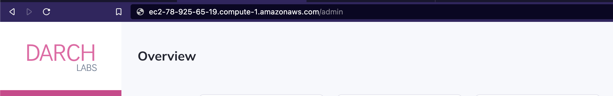

# Client

- [Client](#client)
  - [Introduction](#introduction)
  - [How to use](#how-to-use)
    - [Setup](#setup)
    - [List Event Data](#list-event-data)
    - [Insert Event](#insert-event)
    - [List Events](#list-events)
    - [List event by address](#list-event-by-address)
    - [Delete Event](#delete-event)
    - [Get Event](#get-event)
    - [Start Event](#start-event)
    - [Stop Event](#stop-event)

<div class="toc"></div>

## Introduction

Synchronizer is the Darchlabs module in charge of getting the data from the events of a given contract. With this tool, you can access the logs and do whatever you need, for example inserting the historical data of an event into a database.

In this client tutorial, we will be using the [examples](https://github.com/darchlabs/client-nodejs/tree/main/examples/ts/events) folder from the nodejs client.

## How to use

### Setup

Initialize a typescript repo using _npm:_

```jsx
npm init -y
```

Install the **_darchlabs_** library from npm:

```jsx
npm install -i darchlabs
```

Once you have running a **Darchlabs** instance, you will need to get your _APP DNS (Domain Name SERVER)._ You can get it from the URL of your browser:



Where _[darchlabs.com](http://darchlabs.com)_ would be the APP DNS in this example.

Now that you have the DNS, you will have to add `/sync` to it at the end. This will be useful for creating a darchlabs instance using the client.

Finally, let’s create a file for getting the ABI of a smart contract (will be useful for creating a synchronizer)

```jsx
touch abi.ts
```

Copy the following code corresponding to the ABI, inside the `abi.ts` file:

<details>
<summary>ABI</summary>

```tsx
// abi.ts

export const abi = {
  anonymous: false,
  inputs: [
    {
      indexed: false,
      internalType: "uint256",
      name: "amount",
      type: "uint256",
    },
    {
      indexed: true,
      internalType: "address",
      name: "userAddr",
      type: "address",
    },
    {
      indexed: false,
      internalType: "uint256",
      name: "amount1",
      type: "uint256",
    },
    {
      indexed: true,
      internalType: "uint256",
      name: "num",
      type: "uint256",
    },
    {
      indexed: true,
      internalType: "string",
      name: "lala",
      type: "string",
    },
    {
      indexed: false,
      internalType: "string",
      name: "lala2",
      type: "string",
    },
  ],
  name: "Example",
  type: "event",
};
```

</details>

### List Event Data

Returns all of the logs emitted by an event.
Optinally, you can setup a pagination: limiting the received number of events and in how many pages you want to divide them.

```tsx
import { Synchronizers, Options } from "darchlabs";

// Define base URL for API requests
const baseUrl = "http://arch.darchlabs.com/sync";

// Create instance of client
const synchronizers = new Synchronizers(baseUrl);

// Test function for listing event with custom options
async function listEventData() {
  console.log("Testing listEventData with custom options...");

  // Define the address and event name
  const address = "0xcd8c193b1B2b5cf36F26b94ff42118B5C6cA4bef";
  const eventName = "wav3sFrenMirror__PostFunded";

  // Setup the options for the pagination (this is optional)
  const opts: Options = {
    limit: 100,
    page: 2,
    sort: "desc",
  };

  try {
    const response = await synchronizers.listEventData(
      address,
      eventName,
      opts
    );
    console.log("Response:", response);
  } catch (error) {
    console.error("Error:", error);
  }
}

listEventData();
```

### Insert Event

Inserts a new _event_ to be synced by the **_synchronizer_**. It will get the logs of a given contract event, and will return it.

```tsx
import { Synchronizers, EventInput } from "darchlabs";
import { abi } from "./abi.ts";

// Define base URL for API requests
const baseUrl = "http://arch.darchlabs.com/sync";

// Create an instance of the client
const synchronizers = new Synchronizers(baseUrl);

// Function for inserting an event
async function insertEvent() {
  console.log("Testing insertEvent...");

  // Define the address
  const address = "0xc13530546feA5fC787A2d126bB39bDeC20C4cc9e";

  // Define the event
  const event: EventInput = {
    network: "polygon",
    nodeURL: "<your-node-provder-url>",
    abi,
  };

  // Insert the event
  try {
    const response = await synchronizers.insertEvent(address, event);
    console.log("Response:", response);
  } catch (error) {
    console.error("Error:", error);
  }
}

insertEvent();
```

### List Events

Lists all of the synced events or optionally, with pagination, select the ones that you need.

```tsx
import { Synchronizers, Options } from "darchlabs";

// Define base URL for API requests
const baseUrl = "http://arch.darchlabs.com/sync";

// Create instance of client
const synchronizers = new Synchronizers(baseUrl);

// Test function for listing events with custom options
async function listEvents() {
  console.log("Testing listEvents with custom options...");

  // Setup the options. If you want to receive all the events, don't define any options.
  const opts: Options = {
    limit: 1,
    page: 1,
    sort: "desc",
  };

  try {
    const response = await synchronizers.listEvents(opts);
    console.log("Response:", response);
  } catch (error) {
    console.error("Error:", error);
  }
}

// Run test functions
listEvents();
```

### List event by address

Lists the events by a given address. Optionally, you can use pagination.

```tsx
import { Synchronizers, Options } from "darchlabs";

// Define base URL for API requests
const baseUrl = "http://arch.darchlabs.com/sync";

// Create instance of client
const synchronizers = new Synchronizers(baseUrl);

// Test function for listing event with custom options
async function listEventsByAddress() {
  console.log("Testing listEventsByAddress with custom options...");

  // Define the address
  const address = "0xc13530546feA5fC787A2d126bB39bDeC20C4cc9e";

  // Setup the options. Don't define it if you wan't to receive all of the events of the given address
  const opts: Options = {
    limit: 10,
    page: 1,
    sort: "desc",
  };

  try {
    const response = await synchronizers.listEventsByAddress(address, opts);
    console.log("Response:", response);
  } catch (error) {
    console.error("Error:", error);
  }
}

// Run test functions
listEventsByAddress();
```

### Delete Event

Deletes a synced event.

```tsx
import { Synchronizers } from "darchlabs";

// Define base URL for API requests
const baseUrl = "http://arch.darchlabs.com/sync";

// Create instance of client
const synchronizers = new Synchronizers(baseUrl);

// Test function for deleting event
async function deleteEvent() {
  console.log("Testing deleteEvent...");

  const address = "0xc13530546feA5fC787A2d126bB39bDeC20C4cc9e";
  const eventName = "Example";

  try {
    const response = await synchronizers.deleteEvent(address, eventName);
    console.log("Response:", response);
  } catch (error) {
    console.error("Error:", error);
  }
}

// Run test function
deleteEvent();
```

### Get Event

Returns the info of the given event.

```tsx
import { Synchronizers } from "darchlabs";

// Define base URL for API requests
const baseUrl = "http://arch.darchlabs.com/sync";

// Create instance of client
const synchronizers = new Synchronizers(baseUrl);

// Test function for getting event
async function getEvent() {
  console.log("Testing getEvent...");

  const address = "0xc13530546feA5fC787A2d126bB39bDeC20C4cc9e";
  const eventName = "Example";

  try {
    const response = await synchronizers.getEvent(address, eventName);
    console.log("Response:", response);
  } catch (error) {
    console.error("Error:", error);
  }
}

// Run test function
getEvent();
```

### Start Event

Starts an stopped event. If it is already running, it will fail.

```tsx
import { Synchronizers } from "darchlabs";

// Define base URL for API requests
const baseUrl = "http://arch.darchlabs.com/sync";

// Create instance of client
const synchronizers = new Synchronizers(baseUrl);

// Test function for starting event
async function startEvent() {
  console.log("Testing StartEvent...");

  const address = "0xc13530546feA5fC787A2d126bB39bDeC20C4cc9e";
  const eventName = "Example";

  try {
    const response = await synchronizers.startEvent(address, eventName);
    console.log("Response:", response);
  } catch (error) {
    console.error("Error:", error);
  }
}

// Run test function
startEvent();
```

### Stop Event

Stops a running event. If it is already stopped, it will fail.

```tsx
import { Synchronizers } from "darchlabs";

// Define base URL for API requests
const baseUrl = "http://arch.darchlabs.com/sync";

// Create instance of client
const synchronizers = new Synchronizers(baseUrl);

// Test function for stopping event
async function stopEvent() {
  console.log("Testing StopEvent...");

  const address = "0xc13530546feA5fC787A2d126bB39bDeC20C4cc9e";
  const eventName = "Example";

  try {
    const response = await synchronizers.stopEvent(address, eventName);
    console.log("Response:", response);
  } catch (error) {
    console.error("Error:", error);
  }
}

// Run test function
stopEvent();
```
